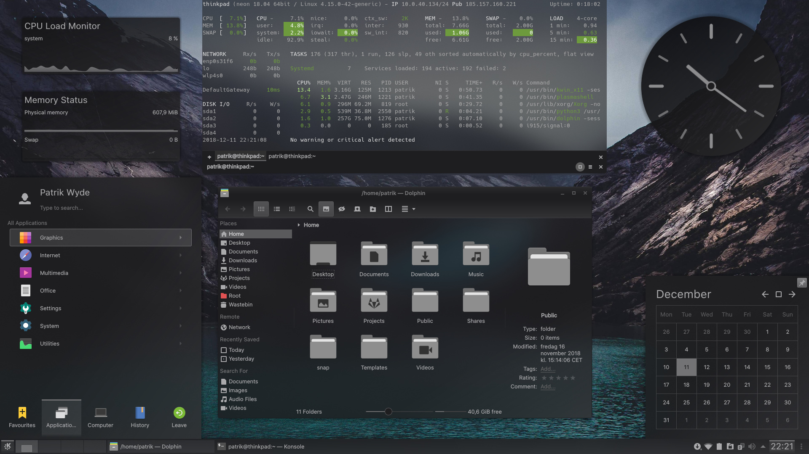

# Monochrome KDE
<div align="center">
    
</div>

## :information_source: About
A dark theme for the KDE Plasma desktop environment inspired by black and white photography.

## :floppy_disk: Install Instructions
At the time of writing there are no Linux distribution packages available. Install the complete theme manually using `git clone` or the provided install [script](install.sh). See [instructions](#install-script) below. This method works on all Linux distributions.

Individual theme components can also be downloaded from [KDE Store](https://store.kde.org)/[OpenDesktop.org](https://www.opendesktop.org) or using [Plasma System Settings](https://userbase.kde.org/System_Settings).

| **Name**                    | **Preview**                                    | **KDE Store** (tar.gz)                           |
|:----------------------------|:----------------------------------------------:|:------------------------------------------------:|
| Global Theme (Plasma 6)     | [🖼️](screenshots/plasma/preview-1920x1080.png) | [:floppy_disk:](https://www.pling.com/p/2143824) |
| Global Theme (Plasma 5)     | [🖼️](screenshots/plasma/preview-1920x1080.png) | [:floppy_disk:](https://www.pling.com/p/1361190) |
| Plasma Theme                | [🖼️](screenshots/plasma/preview-1920x1080.png) | [:floppy_disk:](https://www.pling.com/p/1279077) |
| Plasma 6 Window Decorations | [🖼️](screenshots/aurorae/preview.png)          | [:floppy_disk:](https://www.pling.com/p/2143843) |
| Plasma Window Decorations   | [🖼️](screenshots/aurorae/preview.png)          | [:floppy_disk:](https://www.pling.com/p/1279082) |
| Plasma Color Scheme         | [🖼️](screenshots/color-schemes/preview.png)    | [:floppy_disk:](https://www.pling.com/p/1279083) |
| Kvantum Theme               | [🖼️](screenshots/kvantum/preview.png)          | [:floppy_disk:](https://www.pling.com/p/1279088) |
| Konsole Color Scheme        | [🖼️](screenshots/konsole/preview.png)          | [:floppy_disk:](https://www.pling.com/p/1279087) |
| Yakuake Skin                | [🖼️](screenshots/yakuake/preview.png)          | [:floppy_disk:](https://www.pling.com/p/1279089) |
| SDDM Login Theme            | [🖼️](screenshots/sddm/preview.png)             | [:floppy_disk:](https://www.pling.com/p/1283380) |

### Install Script
The installation script will automatically download the latest version from the repository and copy the required files to the default location `$HOME`.

**Note 1**: Script requires the [`wget`](https://www.gnu.org/software/wget/) command. Install it using system's package manager if not present.

**Note 2**: SDDM themes must be installed in the `/usr/share/sddm/themes/` directory. Hence it must be manually installed using `sudo` command. Install script will not do this!

#### Install
```
$ bash install.sh --install
```

#### Uninstall
```
$ bash install.sh --uninstall
```

#### Options
| **Option**         | **Description**                                   |
| ---                | ---                                               |
| `-i`,`--install`   | Install theme in default location (`$HOME`).      |
| `-u`,`--uninstall` | Uninstall theme.                                  |
| `-h`,`--help`      | Display help message including available options. |

## :bulb: Recommendations
For a better visual experience apply the following modifications and settings.

### Application Style
Download and install the [Kvantum theme engine](https://github.com/tsujan/Kvantum/tree/master/Kvantum).

**Note**: Until `v1.1.0` is released, use the latest [Git](https://github.com/tsujan/Kvantum/blob/master/Kvantum/INSTALL.md#compilation) version of Kvantum theme engine for Plasma 6 compatibility.

Start **Kvantum Manager** > **Change/Delete Theme** > select theme **Monochrome** > **Use this theme**.

### Window Decorations
Change the default window border size in **System Settings** > **Colors & Themes** > **Window Decorations** > select **Tiny Window Borders** from the drop-down list > **Apply**.

### Icons
Download and install the [Papirus icon theme](https://github.com/PapirusDevelopmentTeam/papirus-icon-theme).

#### Folder Icon Colour (optional)
The folder colour can be changed using [papirus-folders](https://github.com/PapirusDevelopmentTeam/papirus-folders).

```
$ papirus-folders -C grey
```

### Desktop Effects
Enable **Blur** in **System Settings** > **Window Management** > **Desktop Effetcs**.

### Login Screen (SDDM) - Only compatible with Plasma/Qt 5
Change the login screen theme in **System Settings** > **Colors & Themes** > **Login Screen (SDDM)** > select theme **Monochrome** > **Apply**.

#### Background
Chooce either a background image or the pre-defined solid colour; `#1e1e20`

#### Fonts (optional)
Change default font for **SDDM** in the `/usr/share/sddm/themes/monochrome/theme.conf` configuration file.

### GTK2/3/4 Theme (optional)
Manually copy the included GTK2/3/4 theme from `./gtk` directory to the user theme directory.

```
$ cp -r gtk/Monochrome/ ~/.local/share/themes/
```

#### Note
The GTK2/3/4 theme is pre-build of the official [breeze-gtk](https://github.com/KDE/breeze-gtk.git) theme with the Monochrome KDE colour scheme.

To manually build and install the theme make sure all build dependencies are met and perform the build process.

```
$ git clone https://github.com/KDE/breeze-gtk.git
$ cd breeze-gtk/src/
$ cmake ./
$ sh build_theme.sh -c Monochrome -t ~/.local/share/themes/Monochrome
```

Enable the new GTK theme in **System Settings** > **Colors & Themes** > **Application Style** > **More Actions** > **Configure GNOME/GTK Application Style...** > select **Monochrome** from the drop-down list > **Apply**.

### Plymouth Boot Splash Screen (optional)
Download and install the [Monochrome Plymouth](https://gitlab.com/pwyde/monochrome-plymouth) theme.

## :heart: Credits
Some graphical elements and artwork in this project is based on other popular themes for the KDE Plasma desktop.

- **Breeze** Plasma theme by [KDE Visual Design Group](https://www.kde.org/plasma-desktop)
- **Materia KDE** Plasma theme by [Papirus Development Team](https://github.com/PapirusDevelopmentTeam/materia-kde)
- **Arc KDE** Plasma theme by [Papirus Development Team](https://github.com/PapirusDevelopmentTeam/arc-kde)
- **Papirus** icon theme by [Papirus Development Team](https://github.com/PapirusDevelopmentTeam/papirus-icon-theme)
- **Darkine KDE** SDDM theme by [Rokin](https://github.com/Rokin05/darkine-kde)

### Honorary Mention
Special credits go to [**Alexey Varfolomeev**](https://github.com/varlesh) for his work on [**Materia KDE**](https://github.com/PapirusDevelopmentTeam/materia-kde) which this theme is based on.

## :page_with_curl: Licenses
This project is licensed under the **GNU General Public License v3.0**. See the [LICENSE](LICENSE) file for more information. Graphical elements and artwork based on other projects are licensed under the following:

- **Materia KDE**: GPLv3
  - **Aurorae Theme**: GPLv3
  - **Kvantum Theme**: GPLv3
  - **Plasma Desktop Theme**: GPLv3
- **Arc KDE**: GPLv3
  - **Kvantum Theme**: GPLv3
  - **Plasma Desktop Theme**: CCPL:by-sa
  - **Plasma Splash Screen**: GPLv3
- **Papirus Icon Theme**: GPLv3
- **Breeze**: LGPL
- **Darkine**: GPLv3
  - **SDDM Theme**: CC-BY-SA

## :ballot_box_with_check: Todo
A list of features and/or components that will be added in the future.

- [x] Global Theme (Plasma 6)
- [x] Global Theme (Plasma 5)
- [x] Plasma Theme
  - [ ] ~~Create a solid theme version.~~
  - [ ] Add visual feedback in task manager for minimized applications.
- [x] Plasma Splash Screen
  - [x] Re-design due to issue with progress bar.
  - [ ] ~~Replace busy widget spinner with a working progress bar.~~
- [x] Plasma 6 Window Decorations
- [x] Plasma Window Decorations
- [x] Plasma Color Scheme
- [x] Kvantum Theme
  - [x] Create alternative theme with more transparency and blur.
- [x] Konsole Color Scheme
  - [x] Change colors to match theme better.
- [x] Yakuake Skin
  - [ ] Add button for new tab.
- [x] SDDM Login Theme
  - [x] Change colours to match theme better.
  - [x] Add custom font support.
  - [x] Change font colour in all elements if possible.
  - [ ] Re-design for Plasma/Qt 6.
- [x] Add GTK2/3 theme based on [breeze-gtk](https://cgit.kde.org/breeze-gtk.git/).
- [x] [Plymouth Theme](https://gitlab.com/pwyde/monochrome-plymouth)
