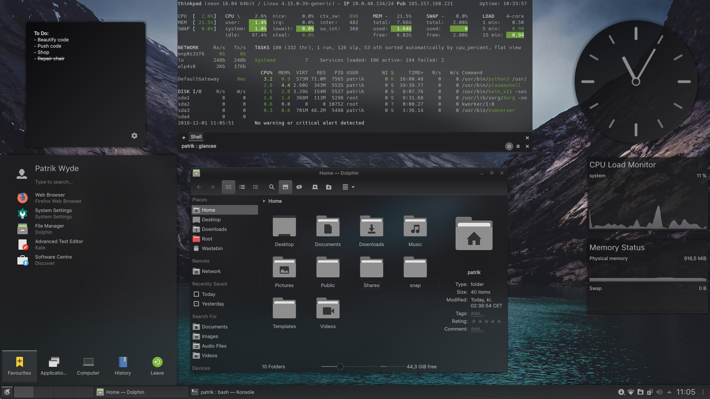

# Monochrome KDE - README



## About
A dark theme for the KDE Plasma 5 desktop environment inspired by black and white photography.

The theme includes the following:

- Aurorae Theme
- Konsole Colour Scheme
- Kvantum Theme
- Plasma Colour Scheme
- Plasma Desktop Theme
- Plasma Look and Feel
- Plasma Splash Screen
- SDDM Theme
- Yakuake Skin

## Install Instructions
At the time of writing there are no packages available. Install the theme manually using `git clone` or the provided install [script](install.sh). See instructions below. This method works on all distributions.

### Monochrome KDE Installer
The installation script will automatically download the latest version from the repository and copy the required files to `/usr/share`.

**Install**

```
wget -qO- https://gitlab.com/pwyde/monochrome-kde/raw/master/install.sh | sh
```

**Uninstall**

```
wget -qO- https://gitlab.com/pwyde/monochrome-kde/raw/master/install.sh | uninstall=true sh
```

## Recommendations
For a better visual experience apply the following modifications and settings:

- Download and install the [Kvantum theme engine](https://github.com/tsujan/Kvantum/tree/master/Kvantum).
  - Run `kvantummanager` > **Change/Delete Theme** > select theme **Monochrome** > **Use this theme**.
- Change **Aurorae** theme in **System Settings** > **Application Style** > **Window Decorations** > select **Monochrome**.
- Download and install the [Papirus icon theme](https://github.com/PapirusDevelopmentTeam/papirus-icon-theme).
- Enable **Blur** in **System Settings** > **Desktop Behaviour** > **Desktop Effetcs**.
- Change default font for **SDDM** in the `/usr/share/sddm/themes/monochrome/heme.conf` configuration file (optional). 
- Download and install the [Monochrome Plymouth](https://gitlab.com/pwyde/monochrome-plymouth) theme (optional).

## Credits
Some graphical elements and artwork in this project is based on other popular themes for the KDE Plasma 5 desktop.

- **Breeze** Plasma theme by [KDE Visual Design Group](https://www.kde.org/plasma-desktop)
- **Materia KDE** Plasma theme by [Papirus Development Team](https://github.com/PapirusDevelopmentTeam/materia-kde)
- **Arc KDE** Plasma theme by [Papirus Development Team](https://github.com/PapirusDevelopmentTeam/arc-kde)
- **Papirus** icon theme by [Papirus Development Team](https://github.com/PapirusDevelopmentTeam/papirus-icon-theme)
- **Darkine KDE** SDDM theme by [Rokin](https://github.com/Rokin05/darkine-kde)

The installation [script](install.sh) is a modified version of the [original](https://github.com/PapirusDevelopmentTeam/materia-kde/blob/master/install.sh) script file supplied with the **Materia** and **Arc** KDE Plasma 5 theme by [Papirus Development Team](https://github.com/PapirusDevelopmentTeam/papirus-icon-theme).

## Licenses
This project is licensed under the **GNU General Public License v3.0**. See the [LICENSE](LICENSE) file for more information. Graphical elements and artwork based on other projects are licensed under the following:

- **Materia KDE**: GPLv3
  - **Aurorae Theme**: GPLv3
  - **Kvantum Theme**: GPLv3
  - **Plasma Desktop Theme**: GPLv3
- **Arc KDE**: GPLv3
  - **Kvantum Theme**: GPLv3
  - **Plasma Desktop Theme**: CCPL:by-sa
  - **Plasma Splash Screen**: GPLv3
- **Papirus Icon Theme**: GPLv3
- **Breeze**: LGPL
- **Darkine**: GPLv3
  - **SDDM Theme**: CC-BY-SA

## Todo
A list of features and/or components that will be added in the future.

- [x] Aurorae Theme
- [ ] Add GTK2/3 Theme based on Materia or Arc.
- [x] Konsole Colour Scheme
  - [x] Change colours to match theme better.
- [x] Kvantum Theme
  - [ ] Create alternative theme with more transparency and blur.
- [x] SDDM Theme
  - [x] Change colours to match theme better.
  - [x] Add custom font support.
  - [x] Change font colour in all elements if possible.
- [x] Plasma Colour Scheme
- [x] Plasma Desktop Theme
- [x] Plasma Look and Feel Theme
- [ ] Plasma Splash Screen
  - [x] Re-design due to issue with progress bar.
  - [ ] ~~Replace busy widget spinner with a working progress bar.~~
- [x] [Plymouth Theme](https://gitlab.com/pwyde/monochrome-plymouth)
- [x] Yakuake Skin
